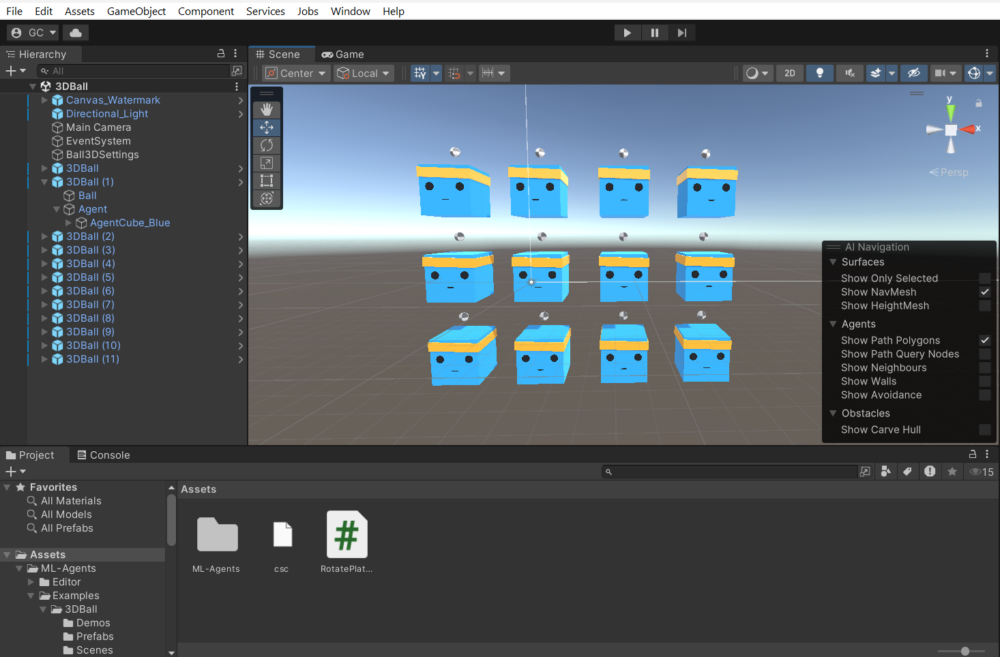
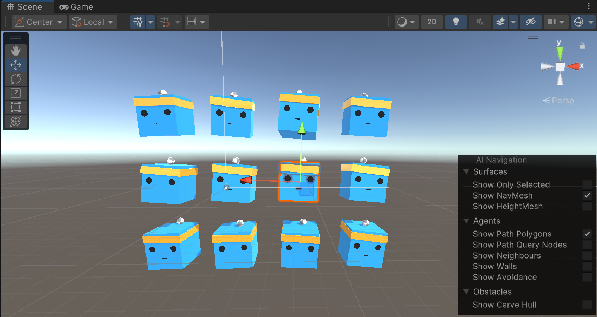
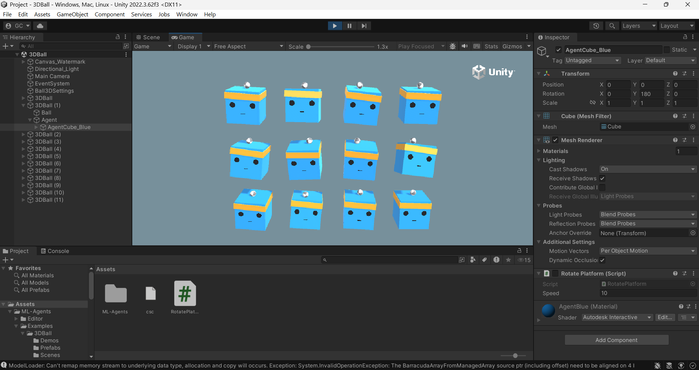

# 🎮 Multi-Agent 3D Balance Ball (Unity ML-Agents)

## 📌 Overview

This project implements a reinforcement learning-based agent using Unity ML-Agents.
The agent learns to balance a ball on top of a cube by controlling its rotation.

The environment uses multiple agents trained in parallel to improve learning efficiency and convergence speed.

---

## 📸 Output / Demo

### 🟢 Initial Setup



### 🔵 Multiple Agents Running



### 🟡 Training / Gameplay View



---

## 🎯 Objective

* Balance the ball on the cube for as long as possible
* Prevent the ball from falling

---

## 🧠 Environment Details

* Agents: 12 (trained simultaneously)

* Observation Space (8 variables):

  * Cube rotation (X, Z)
  * Ball position (X, Y, Z)
  * Ball velocity (X, Y, Z)

* Action Space:

  * 2 Continuous Actions:

    * X-axis rotation
    * Z-axis rotation

---

## 🏆 Reward Function

* +0.1 → For every step the ball remains balanced
* -1.0 → If the ball falls

---

## ⚙️ Training Details

* Algorithm: PPO (Proximal Policy Optimization)
* Framework: Unity ML-Agents
* Backend: PyTorch
* Multi-agent training for faster convergence

---

## 🔧 Custom Modifications

* Multi-agent setup with 12 parallel agents
* Environment configuration and testing
* Training execution using ML-Agents toolkit
* Performance monitoring using reward metrics
* Integration between Unity and Python training pipeline

---

## 🧠 Agent Logic Explanation

The agent observes:

* Platform rotation (X and Z axes)
* Ball position
* Ball velocity

Based on these inputs, the agent learns to:

* Adjust platform tilt smoothly
* Keep the ball centered
* Avoid sudden movements that destabilize the ball

The PPO algorithm updates the policy to maximize cumulative reward over time.

---

## 📈 Results

### ✅ Training Performance

The agent was trained using PPO and successfully converged to an optimal policy.

**Key Observations:**

* Training Steps: ~120,000+
* Final Mean Reward: **100 (Benchmark Achieved)**
* Stable performance observed after convergence

### 📊 Training Logs (Sample)

```text
Step: 12000  → Mean Reward: 1.21
Step: 48000  → Mean Reward: 3.13
Step: 72000  → Mean Reward: 16.31
Step: 96000  → Mean Reward: 84.18
Step: 120000 → Mean Reward: 100.00
Step: 180000 → Mean Reward: 100.00
Step: 216000 → Mean Reward: 100.00
```

### 🧠 Interpretation

The agent initially struggled to balance the ball but gradually improved through reinforcement learning.
After sufficient training, it consistently maintained balance, achieving the benchmark reward of 100.

> This demonstrates successful policy convergence and stable agent behavior.


---

## ▶️ How to Run

### 1️⃣ Activate Python Environment

```bash
mlagents-env310\Scripts\Activate.ps1
```

### 2️⃣ Install ML-Agents (if not already installed)

```bash
pip install mlagents
```

### 3️⃣ Start Training

```bash
mlagents-learn config/ppo/3DBall.yaml --run-id=finalRun
```

### 4️⃣ Run Unity Environment

* Open Unity Hub
* Open this project (`BalanceBall_Project`)
* Navigate to:
  `Assets → ML-Agents → Examples → 3DBall → Scenes`
* Open **3DBall** scene

### 5️⃣ Start Simulation

* Click ▶️ Play in Unity
* Training will begin automatically

---

## 📁 Project Structure

```
Assets/
├── ML-Agents/
├── Scenes/
├── Scripts/
├── Prefabs/

config/
└── ppo/3DBall.yaml

images/
├── image1.png
├── image2.png
└── image3.png
```

---

## 🚀 Future Improvements

* Train for more complex environments (3DBallHard)
* Hyperparameter tuning for faster convergence
* Add TensorBoard visualization
* Improve generalization across environments

---

## 📚 Reference

Unity ML-Agents Toolkit:
https://github.com/Unity-Technologies/ml-agents

---

## 👨‍💻 Author

**Gurudinesh Reddy**

---
